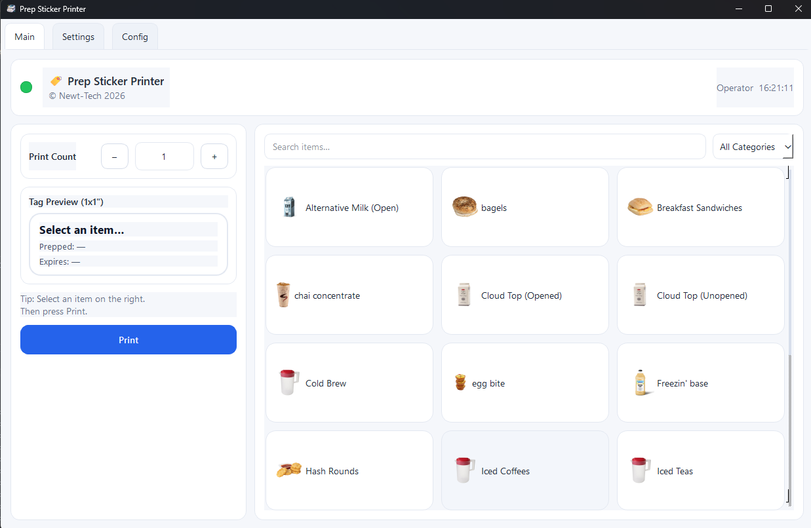
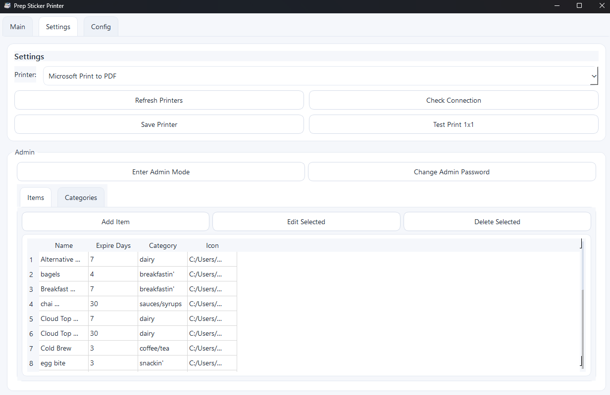
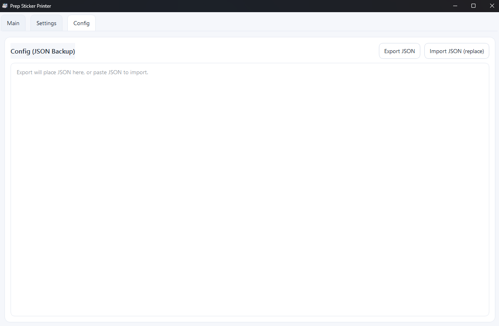
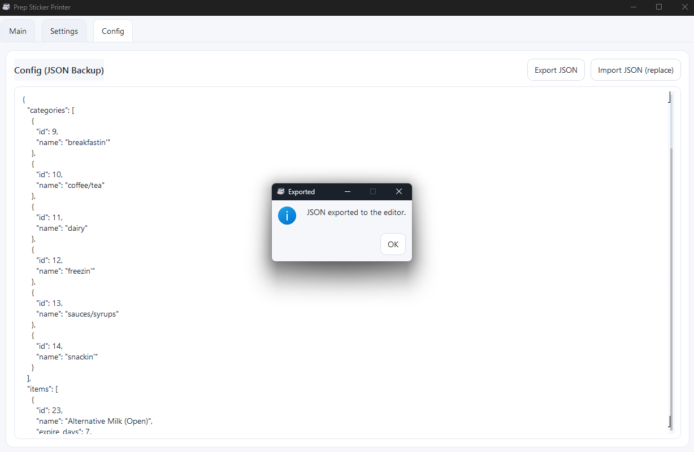
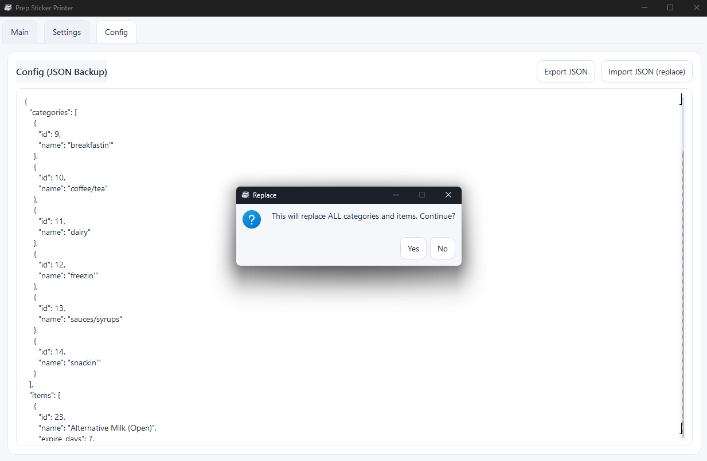
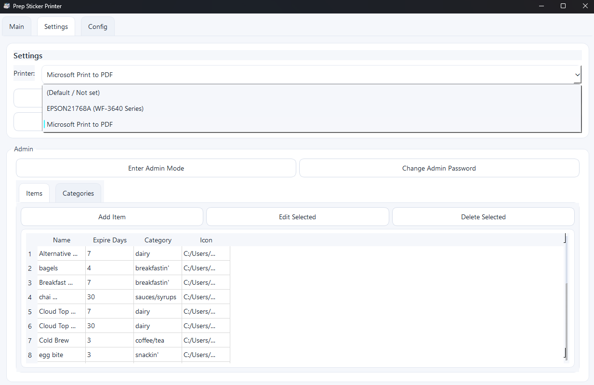
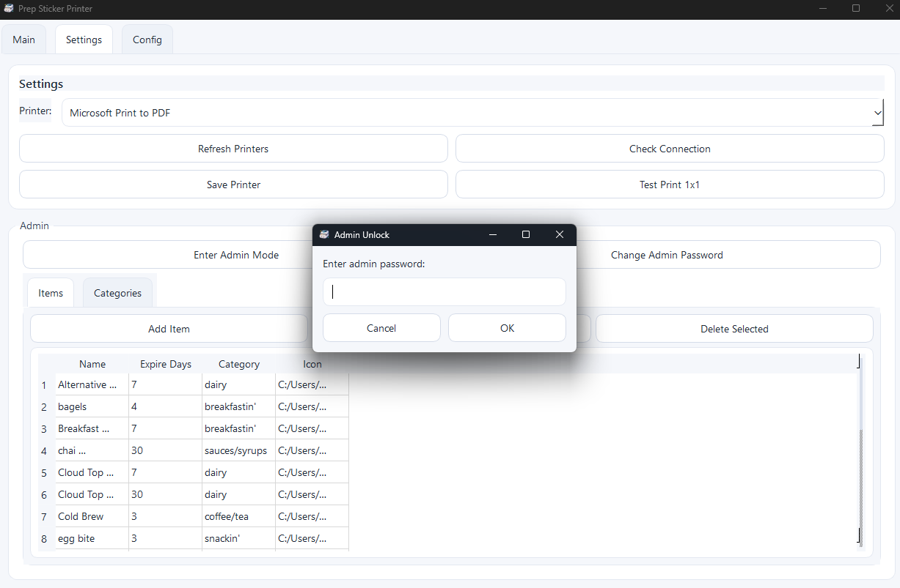
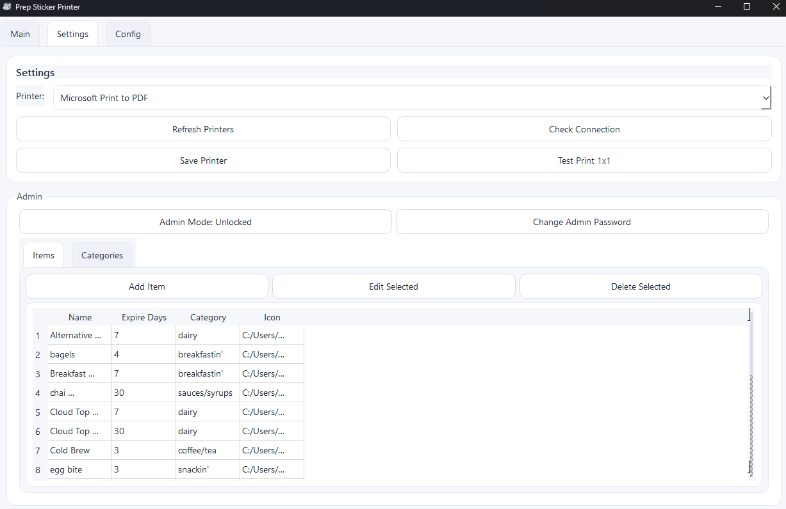
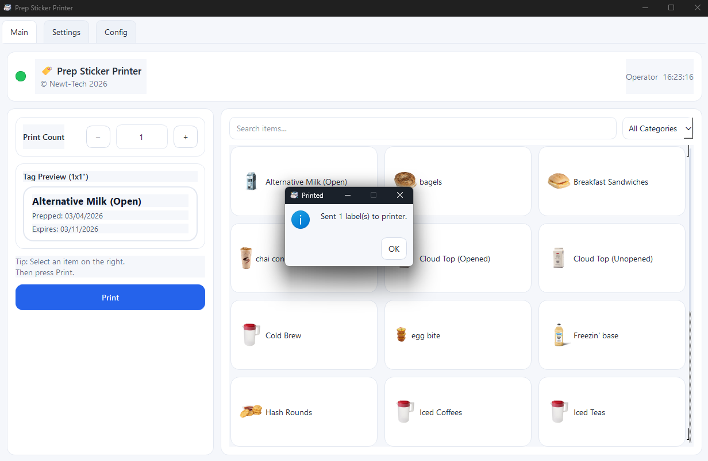
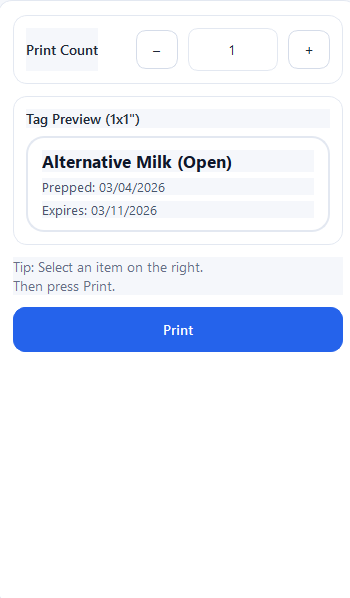

# Tagify – Prep Sticker Printer

Tagify is a desktop application designed to streamline the process of generating and printing food preparation labels.  
It provides a fast, searchable interface for selecting prep items and automatically prints standardized **1×1 inch food safety labels** containing:

- Item name
- Date prepped
- Expiration date

The system is designed for environments such as:

- Restaurants
- Cafes
- Commercial kitchens
- Food production facilities

The application is built with **Python + PySide6** and integrates directly with Windows printer drivers.

---
## 🔐 API Key License Gate (Client Side)

Tagify includes a built-in API key license gate that ensures each installation is registered and authorized before the application can be used.

This system allows the developer to centrally monitor installations and control access to the software.

⚠️ The administrative dashboard and registry system are private and controlled by the developer. End users only interact with the client-side validation process described below.

### How the License Gate Works

When Tagify starts, the program performs a remote validation check against the Tagify licensing server.

The application will only unlock if the API key assigned to the installation is valid and active.

### Startup flow:
```
Program Start
      │
      ▼
Load local config (agent_config.json)
      │
      ▼
Check stored API key
      │
      ▼
Send validation request to server
      │
      ├── Key valid + active → Program unlocks
      │
      └── Key invalid / inactive → UI remains blocked
```
## First Run Behavior

### On a fresh installation:

No API key exists in the configuration.

The License Gate screen will appear.

The user must request a key.

The gate will display a message similar to:

No API key registered.

Please request an API key from the developer.

A request link will be provided which opens the API key request page.

### Entering an API Key

Once a key is issued:

Enter the API key into the license gate field.

### Click Submit.

The key is stored locally in the configuration file.

If valid, the gate will unlock and Tagify will start normally.

### API Key Status States

The license server supports multiple key states.

#### Status	Meaning
```
Active	- The key is valid and Tagify will run
Pending	- Key exists but has not been activated
Paused	- Key temporarily disabled
Revoked	- Key permanently disabled
Invalid	- Key does not exist in registry
```
When a key is not active, the UI remains blocked and displays the corresponding message.

#### Example:

API key pending activation

or

API key not active / paused
### Continuous Validation

Tagify periodically rechecks the license status while running.

This ensures that if a key is:
```
paused

revoked

disabled
```

the application will automatically lock again.
Polling interval is configurable but typically runs every 10–30 seconds.

### Local Configuration

API keys and client settings are stored in:
<code>
%APPDATA%/Tagify/agent_config.json
</code>

#### Example:
```json
{
  "server_url": "http://license-server:2455",
  "api_key": "example_key_here",
  "location_name": "Example Location",
  "location_code": "001",
  "app_version": "1.0.0"
}
```
The configuration file is automatically created if it does not exist.

### Installation Tracking

Each installation generates a unique identifier (app_id) and reports telemetry to the licensing server including:
- Machine hostname
- Application version
- Location name
- Printer status
- Last seen timestamp

This allows the developer to monitor active deployments.

### Security Notes

The license gate is designed to prevent unauthorized use of the software.
The application must successfully validate its API key with the server before unlocking.
If the server cannot validate the key, the UI remains locked until a valid key is provided.

### Offline Behavior

If the license server is temporarily unreachable:
Tagify will retry validation automatically
previously validated keys may continue running until the next check cycle

## Summary

    The API key system provides:
    controlled software distribution
    centralized license management
    installation telemetry
    remote access control
All administrative functions are handled through the private licensing dashboard.

<red style="color:red">NOTE: if the tagify validation server is down Tagify will lock out clients until validation servers return to operation

## Download

<p align="middle">
<a href="https://raw.githubusercontent.com/newt0000/tagify/main/dist/Tagify/tagify-exec.zip">

</a>

<a href="http://newt-tech.com/tools/tagify/demo.html">

</a>
</p>

---


# Table of Contents

1. Overview
2. Architecture
3. Installation
4. Running the Application
5. Packaging the Application
6. Project Structure
7. Detailed Module Documentation
8. Printing System
9. Database System
10. Configuration System
11. Troubleshooting
12. Future Improvements

---

# 1. Overview

Tagify was created to replace manual label writing with a **fast digital workflow**.

Typical workflow:

1. Select a food item
2. Adjust the number of labels
3. Print

Each printed label includes:

```
Item Name
Prepped: MM/DD/YYYY
Expires: MM/DD/YYYY
```

The expiration date is automatically calculated based on the configured shelf life.

The UI is optimized for **touchscreens or quick mouse interaction** in busy kitchens.

---

# 2. Architecture

The application consists of five primary systems:

| System | Responsibility |
|------|------|
| UI Layer | All visual components |
| Database Layer | Stores items, categories, and settings |
| Printer Backend | Manages printer discovery and status |
| Label Renderer | Generates label images |
| Config Manager | Handles data import/export |

---

# 3. Installation

### Requirements

Python 3.11+ recommended.

Install dependencies:

```
pip install PySide6 pillow reportlab pywin32
```

Dependencies:

| Library | Purpose |
|------|------|
PySide6 | GUI framework |
Pillow | Image rendering |
ReportLab | PDF label generation |
pywin32 | Windows printing API |

---

# 4. Running the Application

Run from the project root:

```
python app.py
```

---

# 5. Packaging the Application

To package as a standalone executable:

```
pyinstaller app.py --onefile --windowed --icon=icon.ico --add-data "icon.png;_internal"
```

Explanation:

| Flag | Purpose |
|------|------|
--onefile | Creates single executable |
--windowed | Prevents console window |
--icon | Sets program icon |
--add-data | Bundles resource files |

---

# 6. Project Structure

```
tagify/
│
├── app.py
├── db.py
├── label_print.py
├── printer_backend.py
│
├── ui_main.py
├── ui_settings.py
├── ui_config.py
│
├── styles.py
│
├── data/
│   └── database.db
│
└── _internal/
    └── icon.png
```

---

# 7. Detailed Module Documentation

---

# app.py

Main application entry point.

Responsible for:

- launching the GUI
- initializing the database
- creating application tabs
- coordinating data refresh events

## Functions

### main()

```
def main():
```

Application startup routine.

Steps:

1. Initialize database
2. Create QApplication
3. Apply UI styling
4. Create MainWindow
5. Start Qt event loop

---

## Class: MainWindow

Central window controller.

Creates three major tabs:

| Tab | Purpose |
|------|------|
Main | Label printing interface |
Settings | Printer configuration |
Config | Data management |

### Methods

#### on_data_changed()

Called whenever:

- items are added
- categories change
- configuration is imported

Triggers UI refresh.

---

# ui_main.py

Contains the **primary user interface used during normal operation**.

Responsibilities:

- item search
- category filtering
- label preview
- print controls

---

## Class: MainTab

Primary label printing interface.

### Components

Left Panel:

| Component | Purpose |
|------|------|
Print Count | Number of labels |
Preview | Shows rendered label |
Print Button | Sends job to printer |

Right Panel:

| Component | Purpose |
|------|------|
Item Grid | Select prep items |
Search Box | Filter items |
Category Filter | Organize items |

---

### Methods

#### refresh_tiles()

Rebuilds the item button grid.

Called when:

- database changes
- category filter changes
- search query changes

---

#### reload_categories()

Reloads category list from database.

---

#### refresh_printer_status()

Checks printer availability and updates the status indicator bubble.

---

# ui_settings.py

Contains system configuration tools.

Sections include:

| Section | Description |
|------|------|
Printer Selection | Choose printer |
Admin Panel | Manage prep items |
Category Manager | Organize item groups |

---

## Class: SettingsTab

Primary configuration interface.

### Methods

#### list_printers()

Populates the printer dropdown using Windows printer enumeration.

#### refresh_admin_tables()

Reloads item/category tables after database changes.

---

# ui_config.py

Provides data management tools.

Functions include:

- Import configuration
- Export configuration
- Backup database

Useful for migrating between machines.

---

# label_print.py

Handles **label generation and printing**.

---

## generate_1x1_label_pdf()

```
generate_1x1_label_pdf(item_name, prepped, expires, out_path)
```

Creates a **1×1 inch label** containing:

- item name
- prep date
- expiration date

Uses ReportLab to generate a PDF.

---

## print_label_pdf()

```
print_label_pdf(pdf_path, printer_name)
```

Prints the label file.

Steps:

1. Validate file
2. Resolve printer name
3. Send job to printer spooler
4. Monitor job completion

---

## make_temp_label_path()

Creates temporary storage location for generated labels.

Example:

```
C:/Temp/prep_label_1x1.pdf
```

---

# printer_backend.py

Responsible for:

- printer discovery
- connection status
- driver communication

---

## list_printers()

Returns all printers detected by Windows.

Uses:

```
win32print.EnumPrinters()
```

---

## get_printer_state()

Checks printer status.

Returns:

| Field | Description |
|------|------|
connected | True if printer available |
name | Printer name |
status | Status text |

---

# db.py

Handles all database interactions.

Database type:

```
SQLite
```

Tables:

| Table | Purpose |
|------|------|
items | Prep items |
categories | Item groups |
settings | System configuration |

---

## init_db()

Creates database and tables if missing.

---

## get_items()

Returns all stored prep items.

---

## add_item()

Adds new prep item.

Fields:

| Field | Description |
|------|------|
name | Item name |
expire_days | Shelf life |
category | Item category |

---

# 8. Printing System

Tagify prints labels by:

1. Generating a label image
2. Sending it to the Windows printer driver
3. Scaling to fit a 1×1 inch page

Supported printers:

- Thermal label printers
- Inkjet/laser printers
- Virtual printers

---

# 9. Database System

Uses SQLite for portability.

Benefits:

- No server required
- File-based storage
- Easy backup

---

# 10. Configuration System

Configuration tools allow:

- exporting items
- importing setups
- migrating between devices

---

# 11. Troubleshooting

### Printer not detected

Ensure printer is installed in Windows.

### Printing error

Verify:

- printer selected in settings
- printer is online

### Application fails to launch

Ensure dependencies installed.

---

# 12. Future Improvements

Potential enhancements:

- barcode support
- QR labels
- thermal printer ESC/POS mode
- network printing
- inventory integration
---
## Application Gallery

<p align="center">
  
  
  
</p>

<p align="center">
  
  
  
</p>

<p align="center">
  
  
  
</p>

<p align="center">
  
</p>
---

# License

Internal kitchen use / custom private deployment.\
Protected under Creative Commons 0 1.0 <br/> Copyright &copy; Newt-tech 2026
